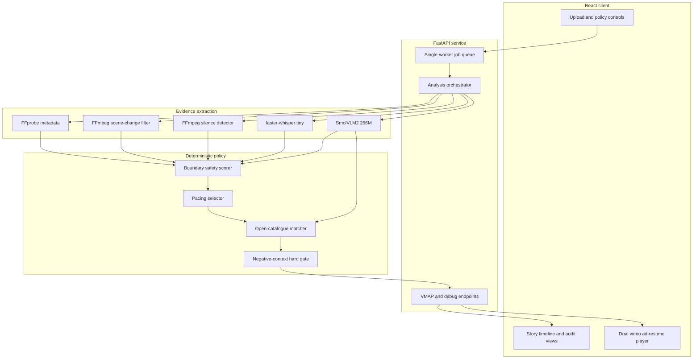
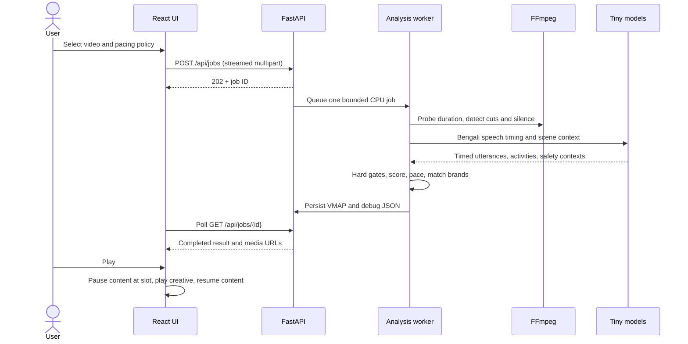

# Movie Ad AI Technical Design

## 1. Goals and constraints

Movie Ad AI converts a long-form Bengali drama and a synthetic brand catalogue into a safe, paced ad schedule. The target runtime is a Hugging Face Docker Space with 2 vCPU, 16 GB RAM, and 50 GB disk.

The primary quality order is:

1. Never cut through detected dialogue.
2. Never place a brand when its negative context is present.
3. Never violate pacing or ad-load policy.
4. Among the remaining options, prefer semantically coherent scene boundaries and the brand closest to the dominant activity.

The system is conservative by design. It emits no break when evidence is insufficient.

## 2. Component architecture



### Ownership boundaries

| Module | Responsibility |
| --- | --- |
| `backend/media.py` | Duration, visual cut, silence, frame, and subtitle evidence |
| `backend/model_runtime.py` | Lazy ASR, VLM, multilingual embeddings, and degradation reporting |
| `backend/decision.py` | Pure safety, matching, and pacing policy |
| `backend/pipeline.py` | Stage orchestration and result assembly |
| `backend/vmap.py` | VMAP 1.0 and inline VAST 4.2 serialization |
| `backend/app.py` | HTTP validation, jobs, artefacts, media, and frontend serving |
| `frontend/src/components/AdPlayer.tsx` | Runtime content-to-ad-to-content transition |
| `frontend/src/components/PipelineExplainer.tsx` | Scroll-driven execution and model trace |

## 3. End-to-end flow



## 4. Scene segmentation

FFmpeg computes frame-level scene-change metadata with a configurable threshold. Cuts within 2.5 seconds are merged by retaining the strongest change. This prevents flashes and rapid edits from creating unusably short scenes.

Each interval between retained cuts becomes a scene. A midpoint frame and overlapping transcript text are passed to the tiny VLM. The model returns normalized English labels for dominant activity, supporting activities, context, mood, and description. If the VLM is unavailable, a validated timed scene-context sidecar is used when supplied; otherwise bilingual transcript terms provide conservative labels.

Visual cuts remain the segmentation anchor. Model-generated text never invents a timestamp.

## 5. Where: interruption safety

For a visual boundary at time `t`, Movie Ad AI records:

- `V`: FFmpeg scene-change strength normalized so twice the configured detection threshold is a full-strength cut
- `S`: local silence duration normalized at 1.2 seconds
- `D`: semantic difference between adjacent scenes
- `E`: distance from programme edges, normalized to the required margin

The score is:

```text
interruptibility = 0.36 V + 0.34 S + 0.20 D + 0.10 E
```

This score is considered only after hard eligibility checks:

- no ASR/subtitle segment overlaps `t ± dialogue_guard_seconds`
- silence is at least `min_silence_seconds`
- the point clears start and end margins
- score is at least `min_interruptibility`

Therefore a strong edit cannot compensate for mid-sentence speech. When ASR is unavailable, the silence requirement remains, which fails closed rather than guessing that speech is absent.

## 6. Whether: pacing policy

Safe candidates are sorted by interruptibility, selected greedily with the configured minimum gap, then restored to chronological order.

The maximum count is the lower of:

- `ceil(duration_hours × max_breaks_per_hour)`, with one possible slot for short-form validation
- the largest count whose total creative duration keeps `ad_seconds / (content_seconds + ad_seconds)` at or below `max_ad_load_percent`

Programme edge margins are 120 seconds for long-form content and scale down to 8% for short-form demonstration clips. A candidate that cannot be matched safely is removed before pacing so it does not consume a slot.

## 7. What: brand matching

The catalogue is validated as data. There are no brand IDs or brand-specific branches in matching code.

For every candidate, adjacent scene text, context, mood, and transcript are compared with each brand's `negative_contexts`. Any exact or semantic match at the hard-block threshold eliminates the brand before scoring.

Remaining brands receive:

```text
match = 0.68 dominant_activity + 0.20 supporting_activities + 0.12 positive_context
```

The dominant activity intentionally outweighs every other signal. Stable ID ordering only resolves exact ties. If all brands are blocked, the boundary cannot become an ad break.

The multilingual MiniLM adapter embeds arbitrary catalogue text, so a ninth brand can participate without taxonomy or code updates. The lexical fallback preserves exact negative-context blocking if the encoder is unavailable.

## 8. Model and resource design

| Function | Model | Approximate role | Loading |
| --- | --- | --- | --- |
| Visual context | SmolVLM2 256M Video Instruct | Representative-frame activity and safety labels | Lazy, CPU FP32 |
| Speech timing | faster-whisper `tiny` | Bengali utterance intervals | Lazy, CPU int8 |
| Semantic matching | multilingual MiniLM L12 v2 | Cross-language context similarity | Lazy, normalized embeddings |
| Structural evidence | FFmpeg | Cuts, silence, frames, metadata | Per job |

Only one analysis runs at a time. PyTorch and model threads are capped at two. Embeddings are cached per process. VLM work is capped by `MAX_VLM_SCENES`; later scenes retain transcript-derived context instead of exhausting CPU. Demo media is generated on demand rather than at process startup, and frame extraction stops whenever VLM is disabled or unavailable.

## 9. Outputs

### Debug JSON

The result records source metadata, policy, actual model/degradation state, scenes, all accepted and rejected candidates, feature values, reasons, matched brands, blocked brands, and final load.

### VMAP

The manifest uses the IAB VMAP 1.0 namespace. Every selected boundary becomes a linear `AdBreak` with SMPTE-style time offset. Each `AdSource` embeds VAST 4.2 containing `AdSystem`, `AdTitle`, impression URL, `Creative`, `Linear`, `Duration`, and a progressive MP4 `MediaFile`.

### Player

The React player tracks content time against scheduled slots. At a boundary it pauses and pins programme time, mounts the creative, records the break as played, and resumes the original video when the creative ends. Restart clears played state so the demonstration is repeatable.

## 10. Security and privacy

- Uploads stream in 1 MiB chunks and stop at 400 MiB by default.
- File suffix and media type are allowlisted; FFmpeg performs the final structural validation.
- Client filenames are reduced to a basename and never become storage paths.
- Job IDs are random 128-bit values.
- Catalogue payloads are capped at 512 KB, reject unknown fields, enforce unique IDs, and limit creatives to HTTPS or owned media paths.
- The API applies CSP, anti-framing, MIME-sniffing, referrer, and permissions headers.
- No credentials, model tokens, uploads, generated media, or model caches are committed.
- No user video is sent to a third-party inference API; all enabled models run in the Space.

## 11. Reliability and scale path

The MVP intentionally uses one in-process queue because the target has two CPU cores. Jobs and artefacts are isolated by ID, and every stage reports monotonic progress. A failed stage records a bounded error rather than returning a partial schedule.

For production scale:

1. Store uploads and artefacts in object storage.
2. Replace `JobStore` and the executor with Redis plus a durable worker queue.
3. Separate FFmpeg CPU workers from model workers.
4. Batch VLM frames and catalogue embeddings.
5. Persist model/version metadata and score distributions for drift review.
6. Add retention deletion and authenticated tenancy around media routes.

The pure decision contracts can remain unchanged across that migration.

## 12. Known limits

- The VLM sees representative frames rather than every frame; events between samples can be missed.
- Silence is a strong safety signal, but overlapping music and speech can reduce detector sensitivity. ASR overlap is the second independent gate.
- Lexical fallback is intentionally less permissive than embedding matching.
- The local queue is not durable across restarts.
- The generated sample validates mechanics, not blind-viewing quality on real dramas.

These limits are visible in each result's `models.degraded` and `models.notes` fields.